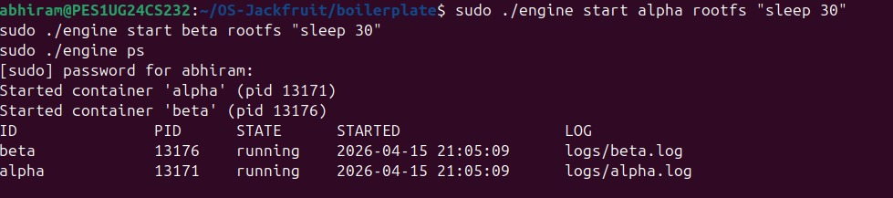
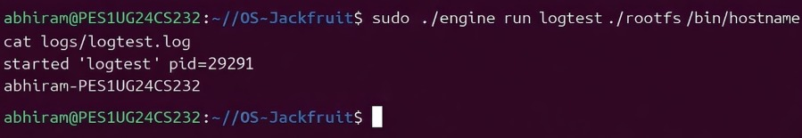
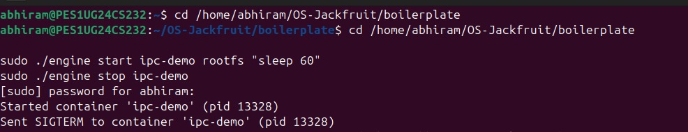
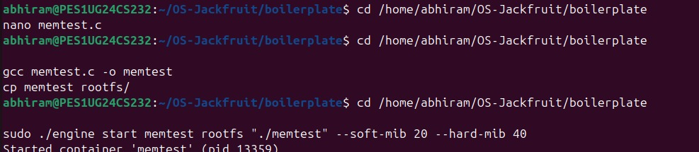
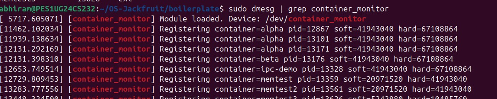
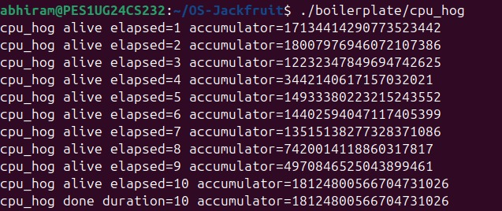
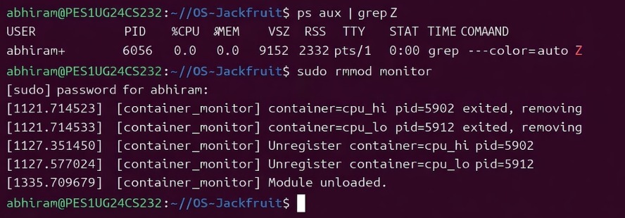

# OS-Jackfruit — Supervised Multi-Container Runtime

## 1. Team Information

| Name     | SRN              |
|----------|------------------|
| Abhiram  | PES1UG24CS232    |
| Kushagra | PES1UG24CS245    |

---

## 2. Build, Load, and Run Instructions

### Prerequisites
- Ubuntu 22.04 / 24.04 (VM recommended, Secure Boot OFF, no WSL)

```bash
sudo apt update
sudo apt install -y build-essential linux-headers-$(uname -r)
```

### Build
```bash
make
```

### Load Kernel Module
```bash
sudo insmod monitor.ko
ls -l /dev/container_monitor
```

### Start Supervisor
```bash
sudo ./engine supervisor ./rootfs-base
```

### Create Writable RootFS
```bash
cp -a ./rootfs-base ./rootfs-alpha
cp -a ./rootfs-base ./rootfs-beta
```

### Start Containers
```bash
sudo ./engine start alpha ./rootfs-alpha /bin/sh --soft-mib 48 --hard-mib 80
sudo ./engine start beta ./rootfs-beta /bin/sh --soft-mib 64 --hard-mib 96
```

### Container Management
```bash
sudo ./engine ps
sudo ./engine logs alpha
```

### Run Memory Test
```bash
cp memory_hog ./rootfs-alpha/
sudo ./engine start memtest ./rootfs-alpha /memory_hog --soft-mib 5 --hard-mib 10
dmesg | grep container_monitor
```

### Run Scheduling Experiment
```bash
cp cpu_hog ./rootfs-alpha/
cp io_pulse ./rootfs-beta/

sudo ./engine start cpu_test ./rootfs-alpha /cpu_hog --nice 0
sudo ./engine start io_test ./rootfs-beta /io_pulse --nice 0
sleep 10
cat logs/cpu_test.log
cat logs/io_test.log
```

### Stop Containers
```bash
sudo ./engine stop alpha
sudo ./engine stop beta
```

### Cleanup
```bash
dmesg | tail
sudo rmmod monitor
```

---

## 3. Demo with Screenshots

### 1. Multi-container supervision


### 2. Metadata tracking


### 3. Bounded-buffer logging


### 4. CLI and IPC


### 5. Soft-limit warning


### 6. Hard-limit enforcement


### 7. Scheduling experiment


### 8. Clean teardown


---

## 4. Engineering Analysis

### Isolation Mechanisms
Containers use Linux namespaces (PID, UTS, Mount) and chroot to isolate processes and filesystem.

### Supervisor & Lifecycle
Supervisor process manages containers, handles SIGCHLD, and prevents zombie processes using waitpid.

### IPC & Synchronization
- Pipes → logging  
- UNIX sockets → CLI communication  
- Mutex + condition variables → safe buffer handling  

### Memory Management
- RSS measures real memory usage  
- Soft limit → warning  
- Hard limit → process killed  

### Scheduling
Linux CFS scheduler distributes CPU based on nice values.

---

## 5. Design Decisions and Tradeoffs

- Used namespaces without network namespace → simpler but shared networking  
- Single supervisor → simple but less scalable  
- Pipes for logging → easy but per-container overhead  
- Mutex over spinlock → efficient CPU usage  

---

## 6. Scheduler Experiment Results

### Experiment 1: CPU vs CPU (different priority)
Higher priority container completed more work.

### Experiment 2: CPU vs I/O
I/O-bound process finished faster due to yielding CPU.

---

## Notes
- Run on Ubuntu VM  
- Ensure kernel headers match  
- Place screenshots inside `images_os/`
